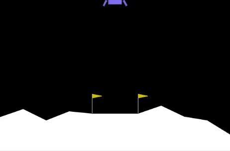

# Reinforcement Learning Projects

This repository contains a collection of Colab notebooks demonstrating various Reinforcement Learning (RL) environments. Each environment showcases different algorithms and challenges. Click on the badges to access the notebooks directly.

# Results

### A3C on Kung Fu Master

### Lunar Landing with Deep Q-Networks

### Pacman with Deep Q-Networks

### AWS deep racer - PPO

## A3C on Kung Fu Master

**Environment**: Kung Fu Master Arcade Game  
**Algorithm**: Asynchronous Advantage Actor-Critic (A3C)  
**Goal**: Train an AI agent to master the Kung Fu Master arcade game, improving its combat skills and strategy over time.  
**Colab Notebook**: 

## Lunar Landing with Deep Q-Networks

**Environment**: Lunar Lander  
**Algorithm**: Deep Q-Network (DQN)  
**Goal**: Safely land the lunar module on the surface of the moon by controlling its descent. The agent must learn to apply thrusters at the right moments to achieve a soft landing at the designated spot.  
**Colab Notebook**: 

## Pacman with Deep Q-Networks

**Environment**: Pacman  
**Algorithm**: Deep Q-Network (DQN)  
**Goal**: Navigate Pacman through various mazes, eating all the dots while avoiding ghosts. The project explores different RL strategies for improving Pacman's survival and scoring abilities.  
**Colab Notebook**: 

### LLM fine tune

Dive into Language Learning Models (LLM) by fine tuning LLama on medical dataset to create Ai Doctor.

## Getting Started

To get started with these notebooks:

1. Click on the "Open In Colab" badge next to the environment you're interested in.
2. Once in Colab, you can run the notebook cells sequentially to see the RL algorithms in action.
3. Feel free to modify the code to experiment with different algorithms or tweak the parameters.

Seperate notebooks and scripts files are available in specific folders as well!

Thank you for exploring the RL models. Happy learning!
